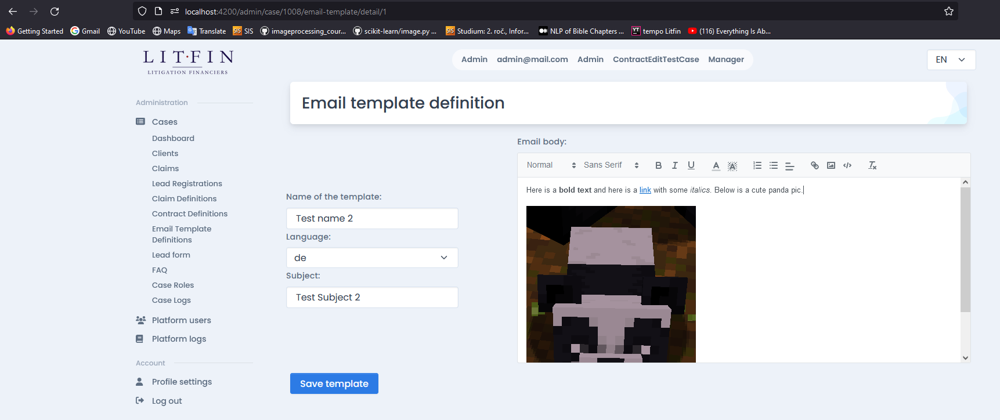
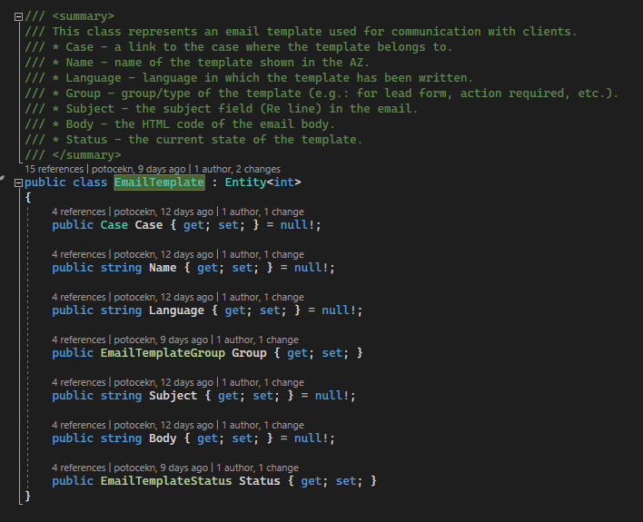
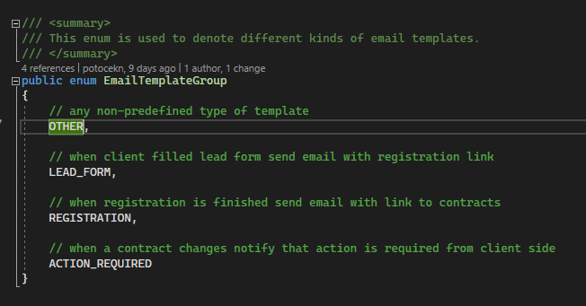
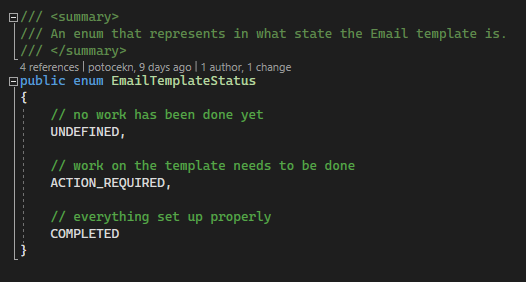
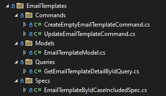
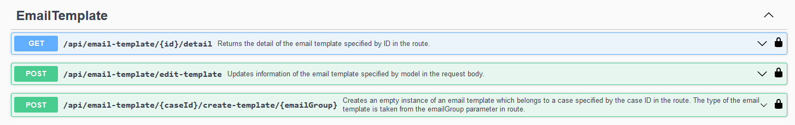

# Email epic - sprint demo

Hello, in this document we would like to present our work on the email epic feature.

## Email edit page

The first feature we would like to describe is the email edit page. This page is responsible for editing the properties of the email template. To be more precise, the following attributes can be specified:

- Name of the template
- Language - the language of the case for which this is defined
- Subject - the line in the email that defines the subject of the email
- Body - the text displayed inside the email

As can be seen in the image above, there are two "columns" on the page. On the right side there is the editor for body definition. In this editor any styles can be defined such as bold, italic or underlined font, font types, links, images, etc. Then on the left side there are all properties that are either string only or selection based.

When wanting to update the template, the button at the bottom of the page needs to be clicked.

As can be seen in the image as well, the URL for the page has the following format:
`http://localhost:4200/admin/case/{case_id}/email-template/detail/{template_id}`

When clicked on the save button a message will appear that informs if the update was successful. Below is an example of success:

## Database

To support email templates we added a new entity called EmailTemplate to our SQL database. Also two enums have been added to denote the template's state and group. The following screenshots show the classes in our model.

Then the features for the email templates have been added. The following screenshot shows the commands, models and queries that were added for email templates:

The commands are responsible for creating empty entity and updating existing entity. Then the model represents the data that are sent to the FE. Queries are responsible for retrieving information about a template. And the specification only includes the case properly, so that the reference to the case ID would be possible.

## Backend endpoints

Let us now move to the backend API. In order to add the support for email templates we added a new email template controller. To that controller three methods have been added:

The screenshot above is from the swagger.

The first method is a simple GET method that returns the details of the email template. This method receives the ID of the template and returns all available information that can be edited.

The second method is a POST method that updates information for an existing entity. The new information are sent to the API as `EmailTemplateModel` in the request body. Based on that the proper entity is found and updated.

The last bud not least endpoint creates an empty email template instance. This endpoint only needs the case ID and the email group to create a new email template. This endpoint is called when users want to add a new template. The template entity is created and then passed to the detail page for editing.
